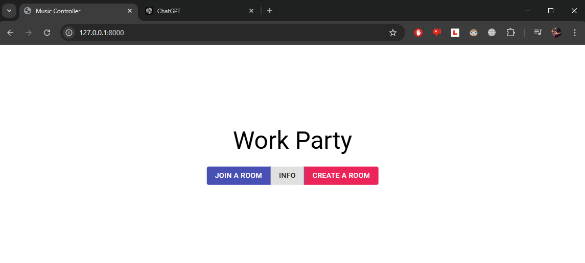
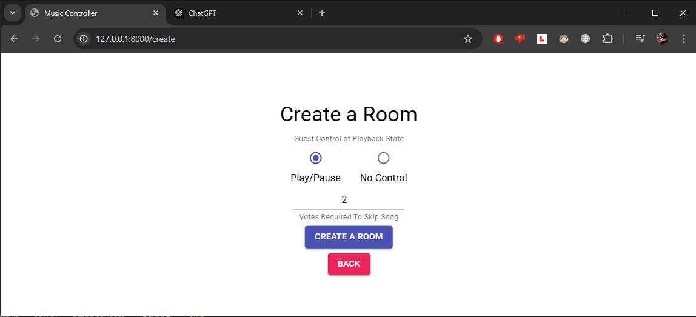
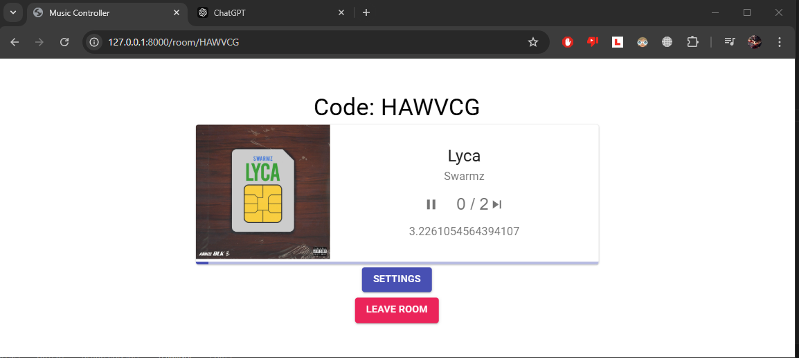
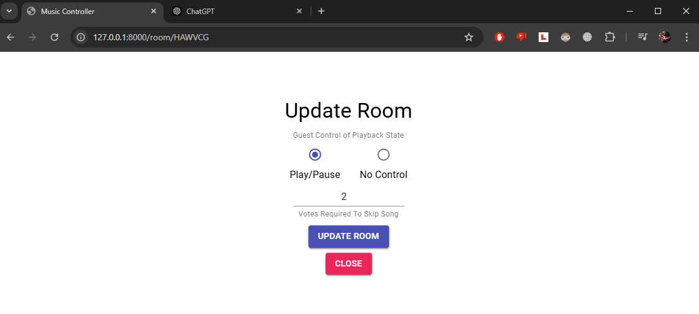
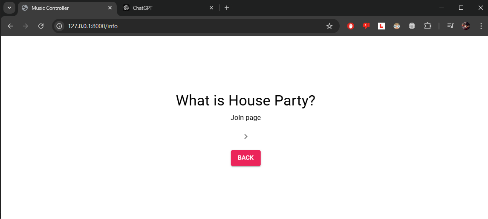

# What It Is
- A react app that lets users create and join music rooms
- A music room can be set up to require x amount of votes to skip songs
- The app interacts with spotify API to make this all possible

### Home Page

### Create Room Page

### Room Page

### Settings Page

### Info Page
